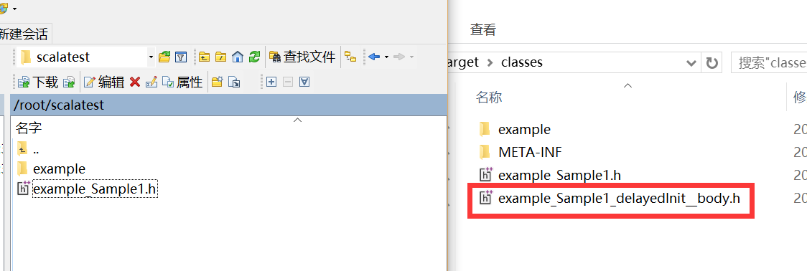
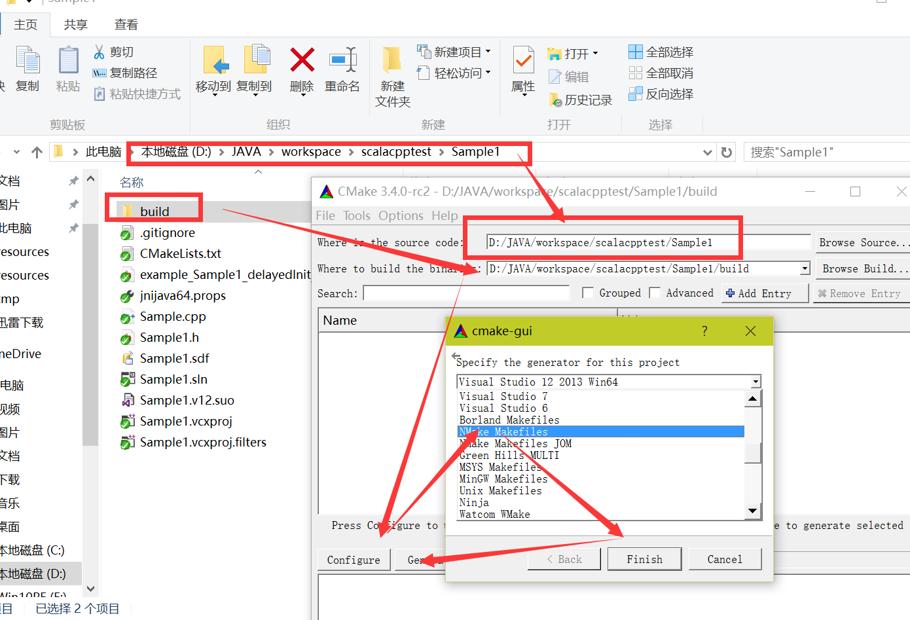
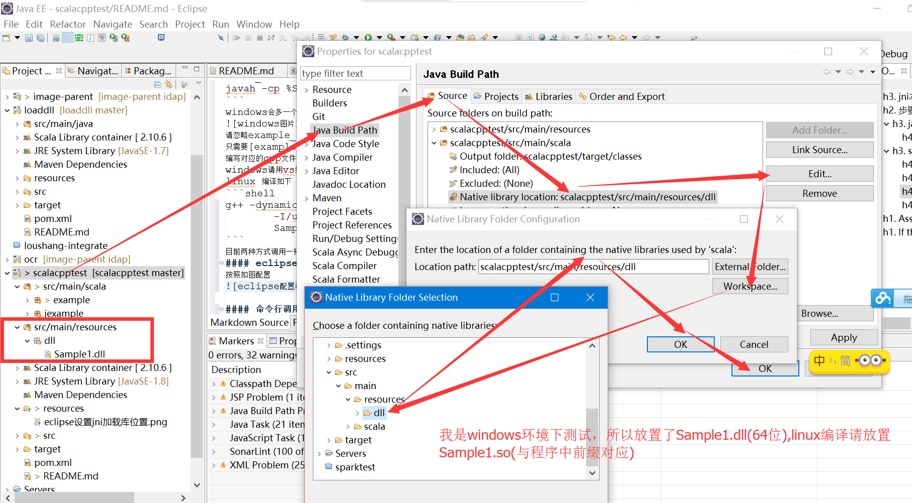

作者[@李杰][1] 如有疑问可留言
### jni本地方法测试
这个演示程序是测试scala和java调用动态库，请用eclipse打开，配置好scala环境(不知道请参考项目[loadll][2])，example包下面为scala程序，jexample为java程序，两者调用动态库一样。
#### 注：java测试时请移动至example目录下，scala移动到jexample下（不然两者会有冲突，请分开测试java和scala）
目录结构如下
+ [src/main/scala](src/main/scala) java和scala类目录
+ [src/main/resources](src/main/resources)动态库放置目录
+ [Sample1](Sample1)动态库源码文件，vs2013项目解决方案,以及Cmakelists.txt

如果满足eclipse环境配置正常，则直接进入步骤2，没有则从步骤1开始
## 步骤1 编译java和scala字节码
### java编译[Sample1.java](src/main/scala/jexample/Sample1.java)(测试时注意修改包名)
```
javac example/Sample1.java
```
### scala编译[Sample1.scala](src/main/scala/example/Sample1.scala)
```
scalac example/Sample1.scala
```

## 步骤2
### java生成.h
####　命令如下
```
javah -classpath . -jni example.Sample1　＃必须打包，及命令目录在class文件上一级，不然调用失败 -jni参数可以省略,注意没有class结尾，不然找不到
```

### scala生成.h,前提是配置好scala环境
#### linux和mac命令如下
```shell
SCALA_LIB=$SCALA_HOME/lib
SCALA_CP=$SCALA_LIB/scala-library.jar:$SCALA_LIB/scala-reflect.jar
javah -cp $SCALA_CP:. example.Sample1
```
#### windows命令如下
```shell
SCALA_LIB=%SCALA_HOME%\lib
SCALA_CP=%SCALA_LIB%\scala-library.jar;$SCALA_LIB\scala-reflect.jar
javah -cp %SCALA_CP%;. example.Sample1
```
#####　注：windows会多一个.h文件，如下图[linux和windows结果](resources/windows和linux的h文件结果比较.png)

请忽略example_Sample1_delayedInit__body.h
只需要[example_Sample1.h](Sample1/Sample1.h)(为了方便重命名Sample1.h)
编写对应的cpp文件[Sample1.cpp](Sample1/Sample1.cpp)

## 步骤3 编译动态库
###　windows请用vs编译
在目录[Sample1](Sample1)下，用vs2103(高版本也行)打开[Sample1.sln](Sample1/Sample1.sln)
### linux 编译如下
```shell
g++ -dynamiclib -shared -fPIC  \
        -I/usr/include -I$JAVA_HOME/include -I$JAVA_HOME/include/linux \
        Sample1.cpp -o Sample1.so
```
### mac os 编译如下
```shell
g++ -dynamiclib -shared -fPIC  \
        -I/usr/include -I$JAVA_HOME/include -I$JAVA_HOME/include/darwin \
        Sample1.cpp -o Sample1.so
```
### Cmake方式，文件[CMakeLists.txt](Sample1/CMakeLists.txt)
#### linux下使用cmake
```shell
cd Sample1
mkdir build
cd build
cmake ../
make
```
#### windows下使用cmake-gui
如图[windows-cmake-gui下使用方式.png](resources/windows-cmake-gui下使用方式.png)


#### 住：目前java和scala两种方式是调用一样的动态库文件，所以觉得复杂时，选用java代码方式编写，获得编译的.h
## 步骤4 调用
#### eclipse 调用方式
按照如图配置[eclipse配置动态库路径](resources/eclipse设置jni加载库位置.png)

或者放进C:\Windows\System32(64位) C:\Windows\SysWOW64(32位)
linux目前不知，接下来直接运行即可

#### 命令行调用方式
VM arguments中加入该动态库文件的路径
```shell
Assumes all files are in the same directory.
If they are not, replace $(pwd) with the directory containing Sample1.so(linux) or Sample1.dylib(os x) or Sample1.dll(windows)

java -Djava.library.path=$(pwd) -cp . example.Sample1
scala -Djava.library.path=$(pwd) -cp . example.Sample1

or

 SCALA_LIB_HOME=$SCALA_HOME/lib
 SCALA_CP=$SCALA_LIB_HOME/scala-library.jar:$SCALA_LIB_HOME/scala-reflect.jar
 java -Djava.library.path=$(pwd) -cp $SCALA_CP:. example.Sample1
```

另附上开源项目javacpp 以及封装一些预制的开源c++库
https://github.com/bytedeco/javacpp
https://github.com/bytedeco/javacv
https://github.com/bytedeco/javacpp-presets


[1]: http://weibo.com/smirklijie
[2]: https://git.oschina.net/smirkcat/loaddll